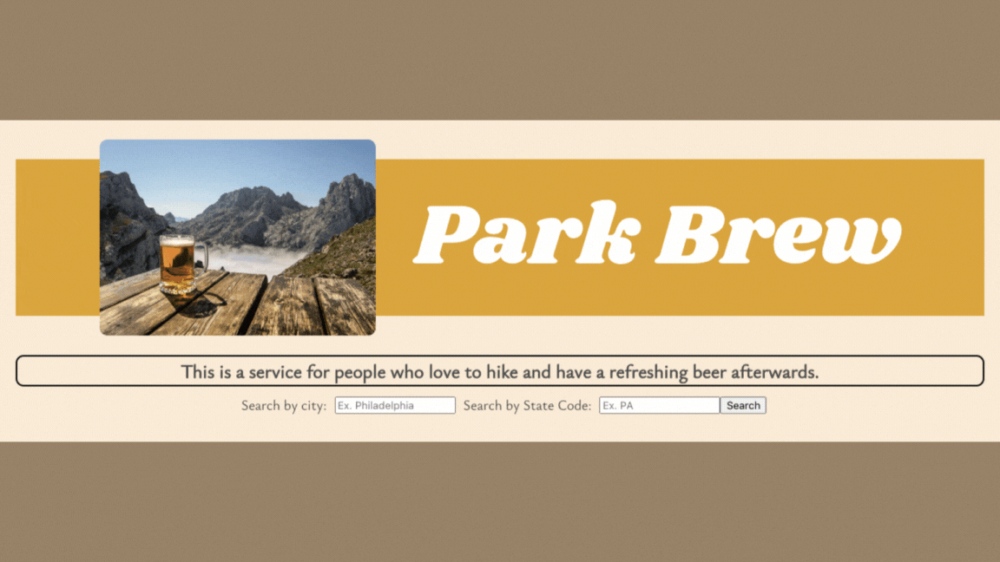

# park-brew

## Description

This website uses API’s to help users locate National Parks within a given state, as well as Breweries in a designated city. This will help park goers find a nice place to unwind after a long day at the park.

## Installation

N/A

## Usage

When the user inputs a city and state into our search bars a list of 5 National Parks and 5 Breweries will populate. The user can click on the different names provided to visit the website for the parks and breweries. If the user is not satisfied with the results they can continue to hit the search bar to see other results in the given location. If the user chooses to click the save icon they can store the results in client-side storage if they want to visit those locations in the future.

## Credits
For our image of beer outside we used this [link](https://www.google.com/search?q=beer+outside+by+mountains&tbm=isch&ved=2ahUKEwiaqcq0_Nf-AhV1UDUKHQsKB8sQ2-cCegQIABAA&oq=beer+outside+by+mountains&gs_lcp=CgNpbWcQAzoECCMQJzoGCAAQBxAeOgYIABAIEB46BAgAEB46BggAEAUQHlDUEljjI2CMJWgAcAB4AIABcogBswmSAQQxMy4xmAEAoAEBqgELZ3dzLXdpei1pbWfAAQE&sclient=img&ei=bLVRZJrDLfWg1QGLlJzYDA&bih=697&biw=1440&rlz=1C5CHFA_enUS989US990#imgrc=6c84RjAK30U_xM).

We recieved assistance from Anthony Maddatu, our instructor, for the code found in the Javascript on lines 70-75 to randomize the items selected from the fetch data arrays.

## License

Please refer to the LICENSE in the repo.

## Deployed Application
[Deployed Application](https://nolannaphys.github.io/park-brew/)
